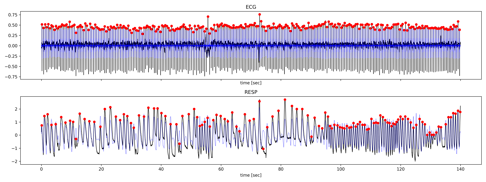
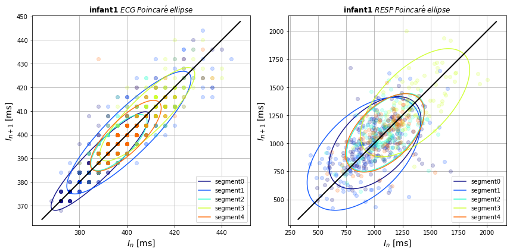

# Overview
This [repository](https://github.com/Frederic-vW/picsdb) contains a collection of [Jupyter notebooks](https://jupyter.org/) written in Python3 to analyze an open cardio-respiratory data set hosted on [PhysioNet](https://physionet.org/):  
*Preterm Infant Cardio-Respiratory Signals Database* (picsdb)  
Download and description here: [PICS database](https://physionet.org/content/picsdb/1.0.0/)  
DOI: https://doi.org/10.13026/C2QQ2M

**Original publication**:  
A. H. Gee, R. Barbieri, D. Paydarfar and P. Indic, Predicting Bradycardia in Preterm Infants Using Point Process Analysis of Heart Rate, in IEEE Transactions on Biomedical Engineering, vol. 64, no. 9, pp. 2300-2308, Sept. 2017. doi:10.1109/TBME.2016.2632746.

**PhysioNet database:**  
Goldberger, A., Amaral, L., Glass, L., Hausdorff, J., Ivanov, P. C., Mark, R., ... & Stanley, H. E. (2000). PhysioBank, PhysioToolkit, and PhysioNet: Components of a new research resource for complex physiologic signals. Circulation [Online]. 101 (23), pp. e215–e220. 

# Aims
1. Detection of ECG and respiratory cycles, i.e. ECG R-peaks and local maxima of the respiratory waveform
2. Compute peak-to-peak interval statistics
3. Compute Poincaré plots for ECG/RESP and quantify their half-axes

## Peak detection

## Poincaré plots:

# Source code
Source code, notebooks and example data are available at: [GitHub repository](https://github.com/Frederic-vW/picsdb)

# Contributors
This repository contains research conducted as part of an Honours project at the [University of New South Wales, Sydney](https://medicalsciences.med.unsw.edu.au/):
- Emma O'Rourke (Student), [ResearchGate](https://www.researchgate.net/profile/Emma-Orourke)
- Frederic von Wegner (Supervisor), other [Projects](https://frederic-vw.github.io/)
- Natasha Kumar (Supervisor), [Lab](https://medicalsciences.med.unsw.edu.au/people/dr-natasha-kumar)

# Requirements
- a working **Python 3** installation, and the following packages:
  - numpy
  - scipy
  - matplotlib
  - wfdb (to read physionet data sets)
  - xlrd (to parse .xlsx files)
- Jupyter (to run notebooks)

# Comments
The full open data set contains recordings from N=10 subjects. This repository only contains the results of 3 subjects. To run the code, download and unzip the full data set from Physionet (link above) and copy the individual files into the subfolder `preterm-infant-cardio-respiratory-signals-database-1.0.0`.
